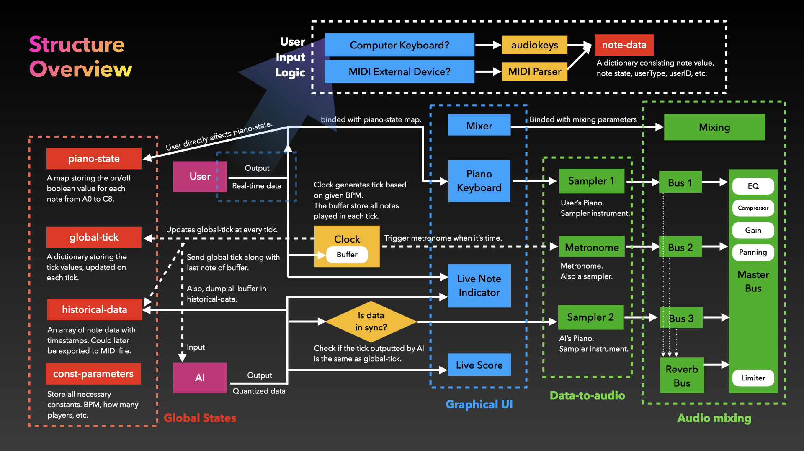

# Structure Overview



# Global States
Global States are maintained throughout the application. They are modifiable.

---

## Tick
The global "current time". A dictionary.

### Example
```javascript
    {
        globalTick: 16,
        barTick: 1,
        localTick: 13
    }

```

### Data Type
    - globalTick: integar, larger than 0.
    - barTick: integar(globalTick / 16). which bar we are at right now.
    - localTick: integar, from 0 to 15.

---

## Historical Notes
TODO

---

## Note Data
- Type: dictionary

- example:
    {
        note: "C4",
        userType: "AI",
        userID: 3,
        globalTime: {
            globalTick: 3;
            localTick: 13;
        },
        noteStatus: true
    }

- type validation
    - note: a string in the format of "C4". e.g. "A#4"
    - userType: a string, whether "AI" or "user".
    - userID: an integar, the ID of the user.
    - globalTime: a Global Time object. see definition [here]()
    - noteStatus: a boolean variable. When it's true, the note is being pressed. When it's false, the note is released.

---

## User Input Buffer
An array of dictionaries.

- example:
    [
        {
        note: "C4",
        userType: "AI",
        userID: 3,
        globalTime: {
            globalTick: 3;
            localTick: 13;
        },
        noteStatus: true
    },
    {
        note: "C4",
        userType: "AI",
        userID: 3,
        globalTime: {
            globalTick: 3;
            localTick: 13;
        },
        noteStatus: true
    },
    ......
    ]

## Clock

- methods:
    - start()
    - stop()
    - triggerMetronome()
    

## AI

- data:
    noteDataMap: {
        noteData,
        noteData,
        noteData
    }

- methods:
    - getNoteData(noteData){
        noteDataMap = noteData;
        func()
    }
    
    - func(){
        var booleanCheck = true;
        var booleanCheck;
    }