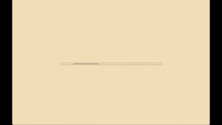

# 🎵 BachDuet Web GUI


Check it out in action [here](https://bachduet.com)!

A Web GUI for [**BachDuet**](http://www2.ece.rochester.edu/projects/air/projects/BachDuet.html), a system for real-time human & machine collabration. This repository could serve as a template for any other real-time collabration network. The project is based on Web Audio & Web MIDI, Using Tone.js, Three.js and Tensorflow.js. The frontend is based on Vue.js.

This repository could be deployed without a server.

---

## 🤩 How to run (for the first time)?

### Project setup
For first time installment, run this in the root directory.
```
npm install
```

### Compiles and hot-reloads for development
After first installment, run this command, then use the browser. Follow the prompts in your terminal!
```
npm run serve
```
You may need Vue DevTools, available in Google Chrome Store.

### Compiles and minifies for production
```
npm run build
```

---

## 😰 Current Problems
- Web MIDI is not supported on all browsers. For this purpose, we would recommend using Chrome.
- We noticed that in many mobile devices, tensorflow.js is having trouble making inferences in time. We would recommend using this web application on desktop/laptop computers and not tablets/smartphones.

---

## 🔨 Configurations
If you have experience with JavaScript, configuring this repository to fit your current model is easy.

### Configurate project display name
You may need to change:
- `package.json`. Here, you need to change the name and version number.
- `main.vue`. This is the main view of the program. Here, you need to change all text in `<template>` section to the text you want to display.

### Configurate model
The model is abstracted as a service worker. Service workers are specialized JavaScript assets that act as proxies between web browsers and web servers. They aim to improve reliability by providing offline access, as well as boost page performance. For more information about service workers, you could check [here](https://developer.mozilla.org/en-US/docs/Web/API/Service_Worker_API).
- The first step may be converting your model to a tensorflow.js ready one.  For more information, you could check tensorflow.js official docs [here](https://www.tensorflow.org/js).
- The model itself is at `/public/neuralWorker.js`. You could define how the service worker will spit out information here. Essentially, the only way for service worker to communicate with the front-end is through `postMessage`. So `neuralWorker.js` is the file for you to define what messages you would want to post to the front-end.
- How should the front-end process the message that neuralworker has posted? You could customize that in `main.vue`, under methods `runTheWorker()` and `workerCallback()`.
- After these two steps, you should be all set in using your model.

### Data gathering
Currently, we use Google Firebase to gather data on performance, playing information and more. The benefit of using something like Firebase is that it saves you the hassle of setting up a server, making it more fast and secure to use. For most demoing purposes, the free tier should suffice.
- Register an application using Google Firebase. Be sure to set up correct rules under Cloud Firestore!
- Check `main.vue`, under `const firebaseApp = initializeApp()`. Change these information to match your firebase app. It's safe to expose these as long as you have the correct security rules setted up under Cloud Firestore.
- You need to create a new collection called `data`. This is hard-coded into `main.vue`.
- If you would like to change the types of data you gather, you could take a further look at the firestore usage, and modify based on code snippets here.

### Deploying
This repository has nothing to do with deploying! You could deploy it to web using any way you would like. However, we would recommend using services like Netlify, since they don't require a server as well. Here's just an example approach of deploying.
- Create a new branch, called `production`.
- Register a free account on Netlify, and link it to this production branch.
- First setup would take longer. After a while, netlify should have already automatically taken care of everything.
- You could further customize your site under netlify.

---

## 🖇 How's the project organized?
The project is built using vue.js, so it follows a standard vue.js application structure. If you are familiar with Vue, feel free to skip this part.

---

### Routing
This project is built using `Vue-cli`, so I used the `Vue-router` module. It's at `/src/router/index.js` right now.

---

### Static files
Static files, as their names suggest, are static. They are stored in `/public`. 

`index.html` serves as a very bare minimum template for the entire project. Right now it basically has nothing in it.

`/audio` directory stores audio samples.

`robots.txt` as the name suggest, is the default robots.txt that search engines use to determine how their spider should work.

---

### src/main.js, src/App.vue and router
`.vue` files are Vue Single File Componment (SFC). You could check [here](https://vuejs.org/v2/guide/single-file-components.html) for more information on that.

`main.js` is the entry point of the entire program, which imports Vue, Vue-Router and other stuff we need, including the `App.vue` file, which acts as the "in-fact" template. It calls `<router-view>`, defined in the routing file as mentioned above `/src/router/index.js`. The router-view deciphers the url, then return the `/src/views/main.vue`, the actual view we are looking for.

Till now, we actually have three layers of "templates". So let's go through them again to try to figure out how they are connected.

First, we have `main.js`, the entry point. It introduces in Vue, router, other stuff we need, along with the next step, `App.vue`.

Then, in `App.vue` (which is a SFC), we have a `<template>` and some basic stylesheets, then it calls the `<ruoter-view>`.

Then, `<router-view>`, which belongs in `/src/router/index.js`, looks at the browser's URL. It determines that since the path right now is `"/"`, it should return the main view, which is `/src/views/main.vue`.

Why is understanding this important? By understanding this, we could gain insight on how to alter the process. For example, if we need to introduce new libraries earlier on the way, we could introduce them in `main.js`. If we need to alter the CSS properties on `body` and `html` element, we could change `App.vue`. If we need to change the router rules (e.g. add a new view), we could just alter the `/src/router/index.js` file.

---

### library

All files in `/src/library` are independent. They are only dependent on a few libraries like Tone.js, which they introduce individually.
-  `instruments.js` provides utilities of defining sampler instruments.
- `math.js` provides helpful math utilities.
- `music.js` is essentially a function, `createRange()`, that's used by both `instruments.js` and `piano-state.js`.  It takes in the start and end notes, and return a range of notes.

---


### UI Components

The UI is made up of 3 parts: a keyboard, a musical-game-style note indicator and a more traditional, score-styled note indicator. 

- `keyboardUI.vue` is for the keyboard UI.
- `scoreUI.vue` is the traditional score UI.
- `gameUI.vue` is a more musical-game-style UI element.
  
All three UIs would communicate with Vuex store to trigger samplers.

---

### Vuex Store

Store is a centralized place for state management. A "store" is basically a container that holds your application state. 
- Stores are reactive. When Vue components retrieve state from it, they will reactively and efficiently update if the store's state changes.
- You cannot directly mutate the store's state. The only way to change a store's state is by explicitly committing mutations. This ensures every state change leaves a track-able record, and enables tooling that helps us better understand our applications.

If you are familiar with OOP practices, you would find Vuex fairly easy to use. For more information about Vuex, you could check the official docs [here](https://vuex.vuejs.org/).

Take a look under `/store`.
- `index.js` would register all store modules.
- under `/modules`, we have all the different modules.
  - `global-settings.js` stores all the global settings that need to be accessible throughout the program.
  - `note-buffers.js` is the place where all notes are buffered and processed.
  - `samplers.js` is where the samplers are located.
  - `tick-number.js` is where all tick numbers are calculated.

---

## 🪄 Design
The current design is centered around BachDuet's core concept, which is a Baroque style music interaction web application. Here, we provide a few steps of our designing process, hoping if they could also be of help to you in thintking about your application's design.

### Interaction
How would the user communicate and interact with the machine? In our approach, we find a musical-game style interaction fits best. This is because many users are anticipated to already be familiar with the interaction style of such game, and it takes the "technological" feelings down a notch. It also emphasizes the concept of real-time interaction.

For more information on this, check out interaction styles [here](https://www.interaction-design.org/literature/book/the-glossary-of-human-computer-interaction/interaction-styles).

### Color Palette
We used several colors derived from common baroque themes.

In the Baroque period, artists liked to use rich and vibrant colors for their color palette. The artists used mostly deep red, greens, and blues for the Caravaggio painting and deep and luminous in earth tones. The rich color was used to show the texture and surface of the object like gold, silk, and velvet. (Sissy Wang) 

These colors are used as a base palette. Then, we could try adding different levels of white and black to it. We would recommend using 4-5 different colors as your base colors at most to prevent a chaotic feel of the page.

Check out [Adobe Color](https://color.adobe.com/) for a lot of interesting palettes and coloring tools.

### Typography
We used serif and sans-serif fonts. The serif font is used to emphasize the Baroque era feel, while the sans-serfi font is used primarily on the keyboard for prompting information.

We also used CDNs for web fonts. You could find the reference for these web fonts under `index.html`.

A more in-depth typography introduction could be found [here](https://material.io/design/typography/understanding-typography.html) provided by Material Design.

## Citation
If you use this codebase in your work, please cite BachDuet's paper and this repository.
```
@inproceedings{bachduet,
  title={BachDuet: A Deep Learning System for Human-Machine Counterpoint Improvisation},
  author={Benetatos, Christodoulos and VanderStel, Joseph and Duan, Zhiyao},
  booktitle={Proceedings of the International Conference on New Interfaces for Musical Expression},
  pages={635–640},
  year={2020}
}
```
